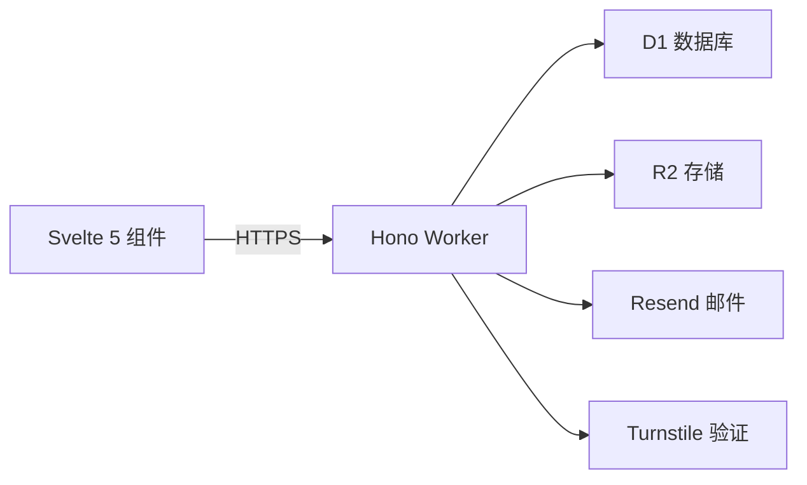
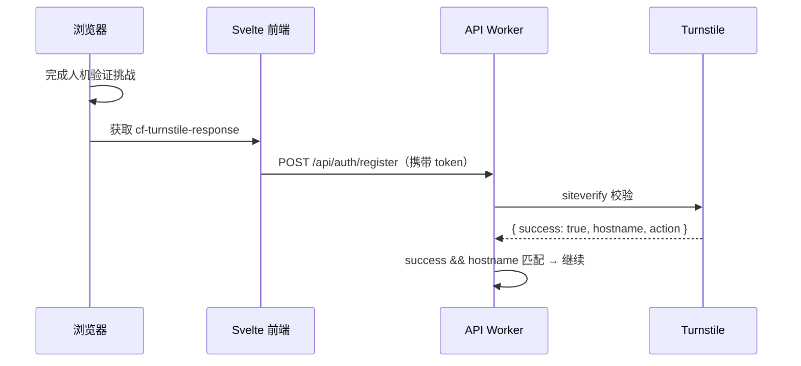
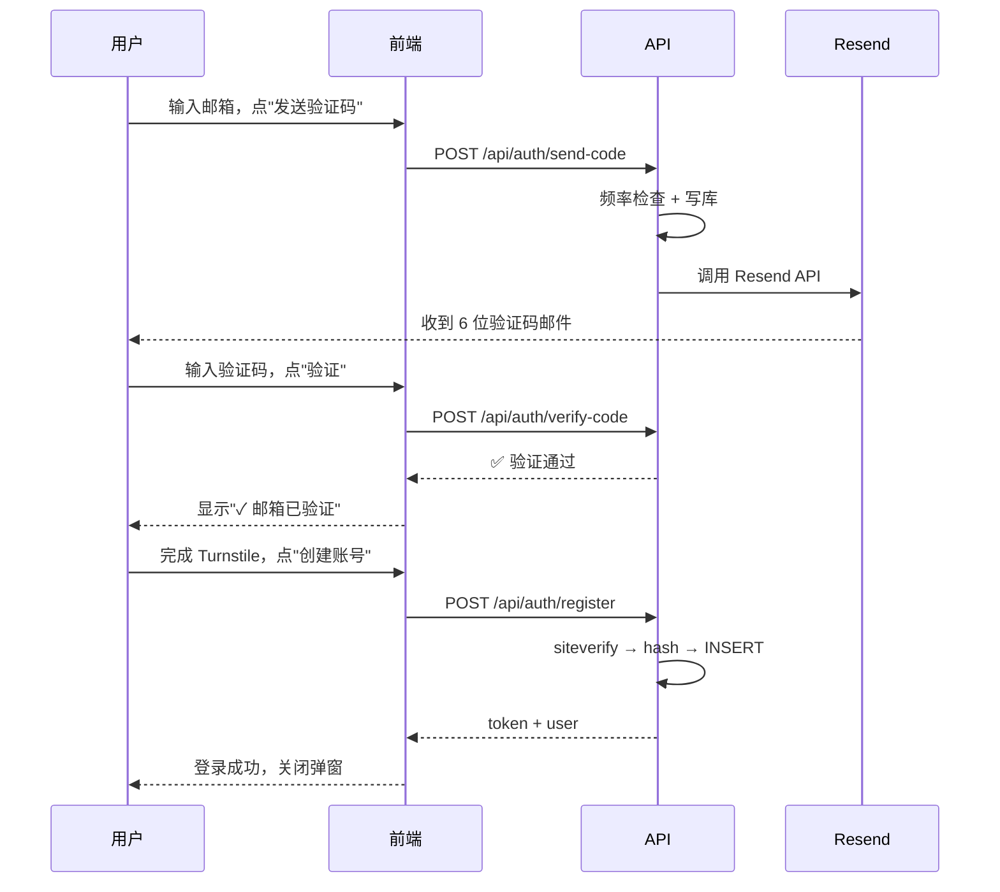

## 为什么要自己造

给博客加评论，市面上的方案看了一圈：

- **Giscus**：要 GitHub 账号，我妈来评论还得先注册 GitHub？
- **Twikoo / Waline**：功能不错，但可能要额外部署后端或者依赖 Vercel
- **Disqus**：广告多，加载慢，国内体验一言难尽

我想要的东西其实很简单：**打开文章 → 输入邮箱 → 收验证码 → 注册完毕 → 直接开聊**。没有第三方登录、没有跳转、没有广告。

正好这几天复习 408 到数据结构的间隙需要换换脑子，花了一天课余休息时间，把这个评论系统从零撸出来了。

## 预览

[grid]


[/grid]

---

## 开源

整套系统已抽离为独立项目，换个域名、填上密钥就能跑。

::github{repo="YCstudent/ustinus-comment"}

---

## 技术选型

整个系统跑在 Cloudflare 全家桶上，**全部免费**：



| 层 | 选型 | 理由 |
|---|---|---|
| 前端 | Svelte 5 Runes | 和博客技术栈一致，`$state`/`$effect` 写起来顺手 |
| 后端 | Hono + Workers | 轻量、快、免费 10 万次请求/天 |
| 数据库 | D1 (SQLite) | 免费 5GB，SQL 开箱即用 |
| 存储 | R2 | 免费 10GB，存头像和评论图片绰绰有余 |
| 邮件 | Resend | 免费 100 封/天，个人博客够用 |
| 验证 | Turnstile | Cloudflare 出品，完全免费 |

> 为什么不用 Cloudflare Email Sending 直接发邮件？需要 Workers Paid 每月 5 刀。Resend 免费额度足够，而且接入只需 3 行代码。

---

## 数据库设计

三张表，简洁清晰：

```sql
-- 用户表
CREATE TABLE users (
  id INTEGER PRIMARY KEY AUTOINCREMENT,
  username TEXT UNIQUE NOT NULL,
  email TEXT UNIQUE NOT NULL,
  password_hash TEXT NOT NULL,
  avatar_url TEXT
);

-- 评论表
CREATE TABLE comments (
  id INTEGER PRIMARY KEY AUTOINCREMENT,
  user_id INTEGER NOT NULL REFERENCES users(id),
  page_slug TEXT NOT NULL,
  content TEXT NOT NULL,
  parent_id INTEGER DEFAULT NULL,
  pinned INTEGER DEFAULT 0,
  created_at DATETIME DEFAULT CURRENT_TIMESTAMP
);

-- 验证码表
CREATE TABLE verification_codes (
  id INTEGER PRIMARY KEY AUTOINCREMENT,
  email TEXT NOT NULL,
  code TEXT NOT NULL,
  used INTEGER DEFAULT 0,
  expires_at DATETIME NOT NULL,
  created_at DATETIME DEFAULT CURRENT_TIMESTAMP
);
```

`pinned` 字段是后来加的，专门给站长置顶评论用。`verification_codes.used` 防止验证码被重复使用。

---

## API 设计

基于 Hono 框架，13 个端点，全部 RESTful 风格，CORS 开放。

### 认证

| 方法 | 路径 | 说明 |
|------|------|------|
| `POST` | `/api/auth/send-code` | 发送 6 位验证码，同一邮箱 10 分钟内最多 3 次 |
| `POST` | `/api/auth/verify-code` | 校验验证码，成功后标记 `used = 1` |
| `POST` | `/api/auth/register` | 注册（需 Turnstile token，密码 SHA-256 哈希） |
| `POST` | `/api/auth/login` | 登录（可选 Turnstile 验证） |
| `POST` | `/api/auth/avatar` | 上传头像到 R2，返回 URL 写入 users 表 |
| `DELETE` | `/api/auth/account` | 注销——级联删除评论、清理 R2 头像 |

### 评论

| 方法 | 路径 | 说明 |
|------|------|------|
| `GET` | `/api/comments?slug=xxx` | 按 slug 查询，置顶优先，时间倒序 |
| `POST` | `/api/comments` | 发表评论（需登录） |
| `DELETE` | `/api/comments/:id` | 删除（本人或管理员） |
| `PATCH` | `/api/comments/:id/pin` | 置顶/取消（仅管理员） |
| `POST` | `/api/upload` | 上传评论插图到 R2 |

### Token 设计

没有用 JWT。Workers 环境里 `crypto.subtle` 足够好用，直接 Base64 编码 JSON：

```
{ userId, username, exp: Date.now() + 7天 }
```

解析在服务端 CPU 时间几乎为零，比 JWT 解析库轻得多。

---

## 安全

### 密码存储

```ts
async function hashPassword(pw: string) {
  const data = new TextEncoder().encode(pw);
  const hash = await crypto.subtle.digest("SHA-256", data);
  return Array.from(new Uint8Array(hash))
    .map(b => b.toString(16).padStart(2, "0")).join("");
}
```

利用 Workers 原生的 Web Crypto API，不引入任何依赖。不存明文，不存可逆加密，只存哈希。

### 速率限制

三层防护：

1. **验证码频率**：同邮箱 10 分钟最多 3 条，SQL 直接查 `verification_codes` 表计数
2. **注册前置验证**：`POST /api/auth/register` 不检查验证码状态——那是前端的事——但如果有人直接调 API，前端 `emailVerified` 状态帮不上忙。不过注册接口本身有 Turnstile 拦截，能挡掉 99% 的脚本攻击
3. **唯一约束**：`users.email UNIQUE`，`users.username UNIQUE`，数据库层面防重复

### Turnstile



前后端双重校验——前端 `$effect` 动态渲染 Turnstile widget 到 `#ts-container`，后端用 `challenges.cloudflare.com/turnstile/v0/siteverify` 验证 token。

---

## 前端细节

`UstinusComment.svelte` 约 550 行，几个值得说的点：

### 注册流程



### 实时 Markdown 预览

预览支持的语法与博客正文完全一致——表、公式、Callout、任务列表，全都支持。关键是 KaTeX 的按需加载：只有在预览内容里检测到 `$...$` 或 `$$...$$` 时，才从 CDN 动态拉 `katex.min.js` 和 CSS，平时零开销。

### 登录/注册按钮加载态

点了"登录"或"创建账号"后按钮立即变成旋转动画 + "登录中..." / "注册中..."，同时 `disabled` 防止重复提交。API 返回错误时自动 `turnstile.reset()`，不需要手动刷新验证码。

### 管理员权限

- **置顶评论**：管理员登录后每条评论出现"置顶/取消置顶"按钮
- **删除任意评论**：管理员看到所有人的删除按钮
- 置顶评论左侧有主题色竖线 + 图钉图标 + "已置顶"标签，自动排到最前面

管理员用户名通过 `adminUsernames` prop 传入，支持多管理员。对应的 API 端点在 `ADMIN_USERNAMES` 环境变量中按逗号分隔配置。

---

## 接入指南

想给你的博客也用上这套评论？三步走：

### 1. 创建资源

```bash
npx wrangler d1 create your-db
npx wrangler r2 bucket create your-bucket
```

Cloudflare Dash → Turnstile → 创建 Widget，拿到 sitekey 和 secret。

Resend 注册拿 API Key（免费 100 封/天）。

### 2. 部署 API

```bash
cd api
npm install
npx wrangler d1 execute your-db --remote --file=../schema.sql
npx wrangler secret put TURNSTILE_SECRET
npx wrangler secret put RESEND_API_KEY
npx wrangler secret put ADMIN_USERNAMES   # 可选
npx wrangler deploy
```

### 3. 前端集成

```html
<script src="https://challenges.cloudflare.com/turnstile/v0/api.js" async defer></script>
```

```svelte
<UstinusComment
  pageSlug={postSlug}
  apiUrl="https://api.your-domain.com"
  turnstileSitekey="0x4AAAAxxx..."
  adminUsernames={["你的用户名"]}
  client:load
/>
```

---

## 反思

代码完全是我听课刷题中间的休息时间写的，从上午八点写到晚上十点，纯代码时间大概5-6个小时左右。

几个体会：

- **Hono 比 Express 更适合 Workers**。轻到极致，路由定义就是 `app.post("/path", handler)`，类型推导也到位
- **D1 做评论绰绰有余**。SQLite 语法 + 5GB 免费空间，十万条评论都装不满
- **Turnstile 接入十分钟**。比起 reCAPTCHA 需要搞 Enterprise 才有无感验证，Turnstile 免费且对用户完全透明
- **Resend 邮件速度极快**。从发请求到收件箱出现验证码，通常不超过 3 秒

整个系统零服务器、零运维、零费用。Cloudflare 是真的把免费额度给得很大方。

项目已开源，欢迎 Star。有建议或 bug 直接提 Issue，或者直接在这个评论区聊。

> 考研？写代码？I can do both.
